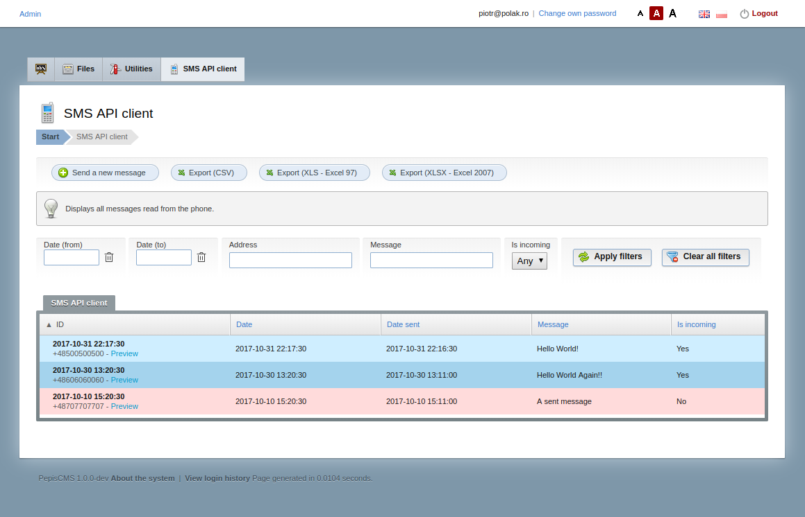
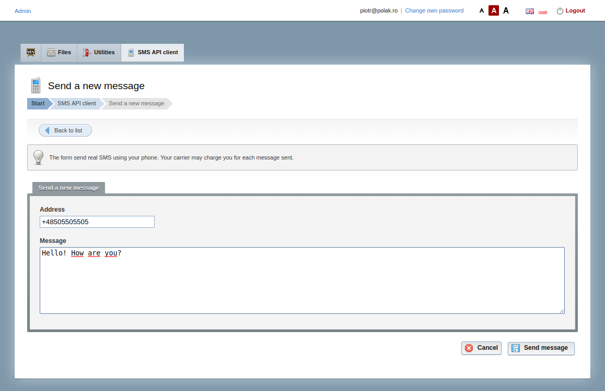

# PepisCMS SMS API demo

SMS API client demo. See the main [CRUD controller](app/modules/sms_api/controllers/Sms_apiAdmin.php).

It combines both [PepisCMS](https://github.com/piotrpolak/pepiscms) and
[Android HTTP server](https://github.com/piotrpolak/android-http-server).

# Prerequisites

 * Docker and Docker compose

# Preview





## Setup steps

* Stat the environment:

    ```bash
    docker-compose up
    ```

* Open the installation script in browser at [http://localhost/install.php](http://localhost/install.php)

* Clean up the environment:

    ```bash
    docker-compose down && docker-compose kill
    ```
    
## Additional commands

* Reinitialize PepisCMS

    ```bash
    sudo rm -rf mysql/ \
          app/application/config/ \
          app/application/cache/ \
          app/index.php app/.htaccess \
          app/composer.lock  \
          app/vendor/
    ```

* Delete all docker containers

    ```bash
    docker rm $(docker ps -a -q)
    ```

* Delete all docker images

    ```bash
    docker rmi $(docker images -q)
    ```
    
* Reinitialize everything

    ```bash
    docker-compose down; docker-compose kill; \
    docker rmi pepiscmssmsapi_web; \
    sudo rm -rf mysql/ app/ && git checkout app/ && \
    docker-compose up
    ```
    
* Get back write rights to app

    ```bash
    sudo chown -R ${USER}:${USER} app/
    ```


